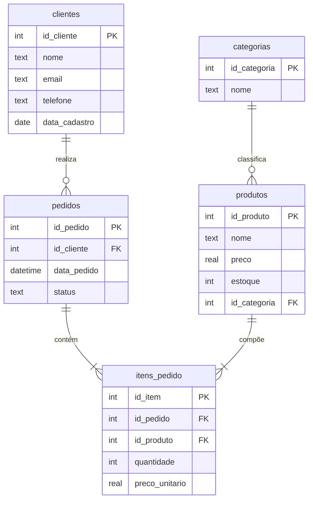

  Order Management DB

Projeto de modelagem de banco de dados relacional utilizando SQLite, simulando um sistema de gestão de pedidos de uma loja de eletrônicos.

Tecnologias
- SQLite
- SQL

Estrutura

O projeto é composto por quatro arquivos principais: o schema.sql é responsável pela criação das tabelas e relacionamentos, o inserts.sql popula o banco com dados de exemplo simulando uma loja de eletrônicos, o queries.sql reúne as principais consultas do projeto e o .gitignore garante que o arquivo do banco de dados não seja enviado ao repositório.


 Modelagem

O banco é composto por 5 tabelas:

- **clientes** → dados dos clientes
- **categorias** → categorias dos produtos
- **produtos** → produtos da loja
- **pedidos** → pedidos realizados
- **itens_pedido** → produtos de cada pedido

Relacionamentos: clientes -> pedidos -> itens_pedido <-produtos <-categorias

 Consultas disponíveis

- Listar todos os clientes
- Buscar cliente por email
- Total gasto por cliente
- Produtos mais vendidos
- Clientes sem pedido
- Ticket médio por pedido
- Pedidos com status e nome do cliente

 Como executar

```bash
sqlite3 banco.db ".read schema.sql"
sqlite3 banco.db ".read inserts.sql"
sqlite3 banco.db ".read queries.sql"
```

## 📊 Diagrama ER


